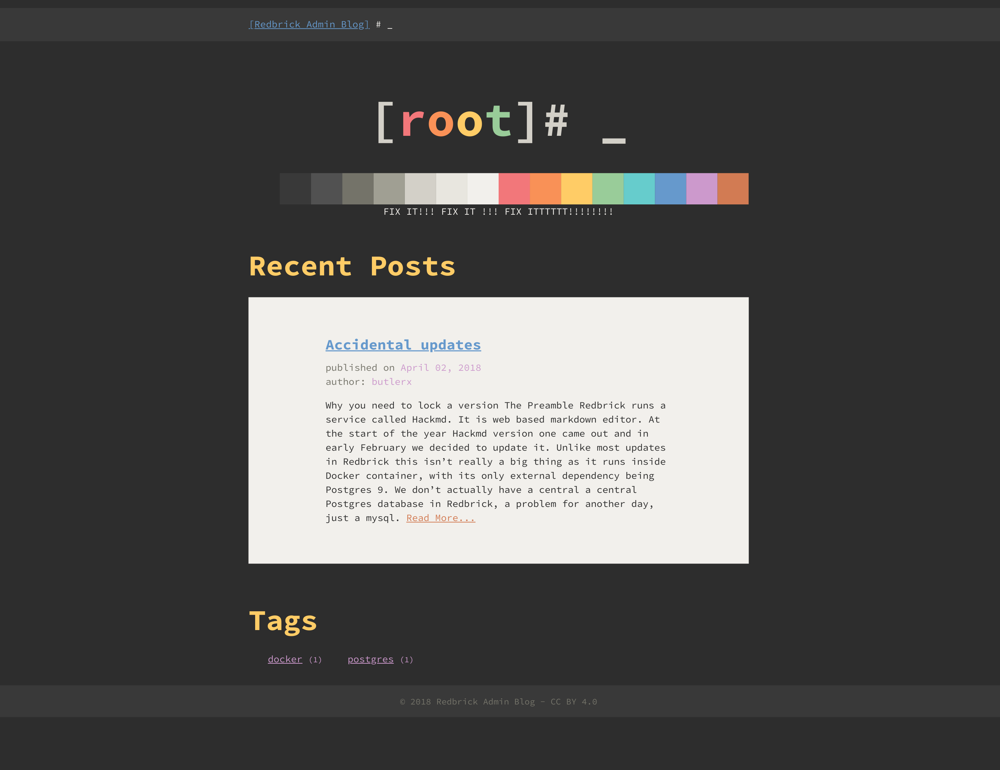

# admin-blog

We screw up sometimes but they're usually fun stories

## Usage

* To Build the site run `hugo -d /path/to/serve/files`
* To Preview the site locally run `hugo serve` and open `localhost:1313`
* To add a new post run `hugo new post/post-title` and then open
  `content/post/post-title` in your editor

For everything else check the [docs](https://gohugo.io/documentation/)
